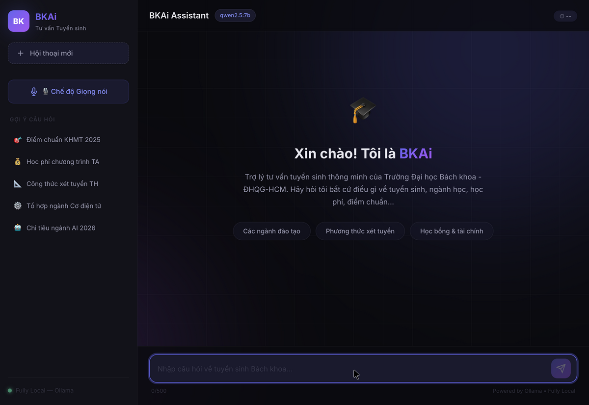
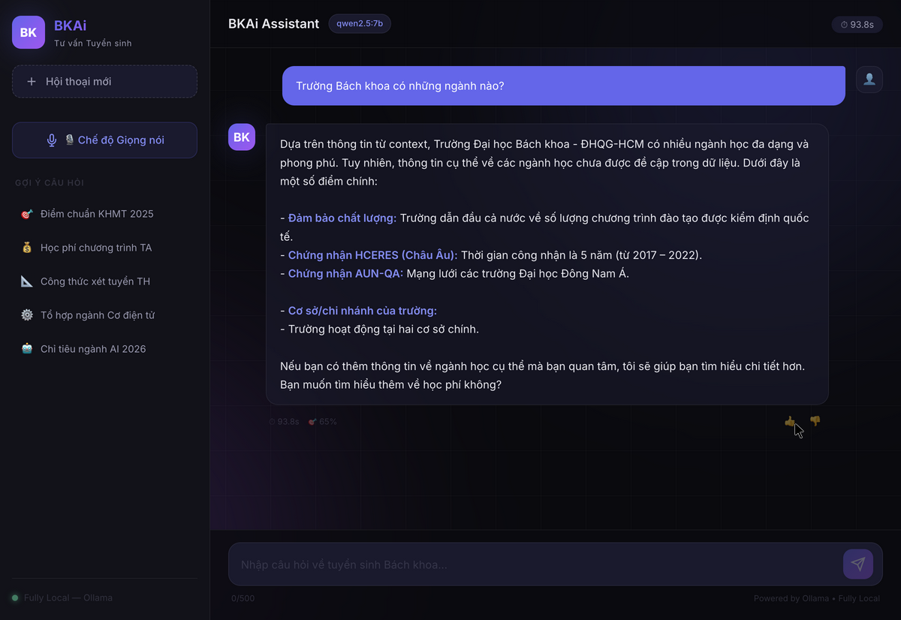
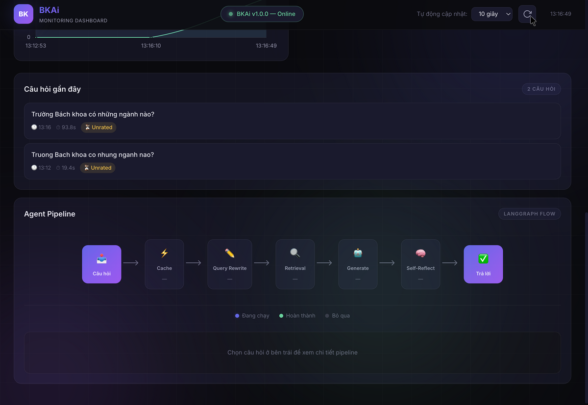
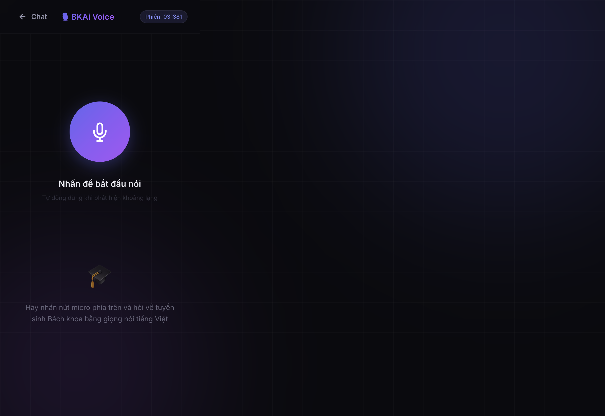
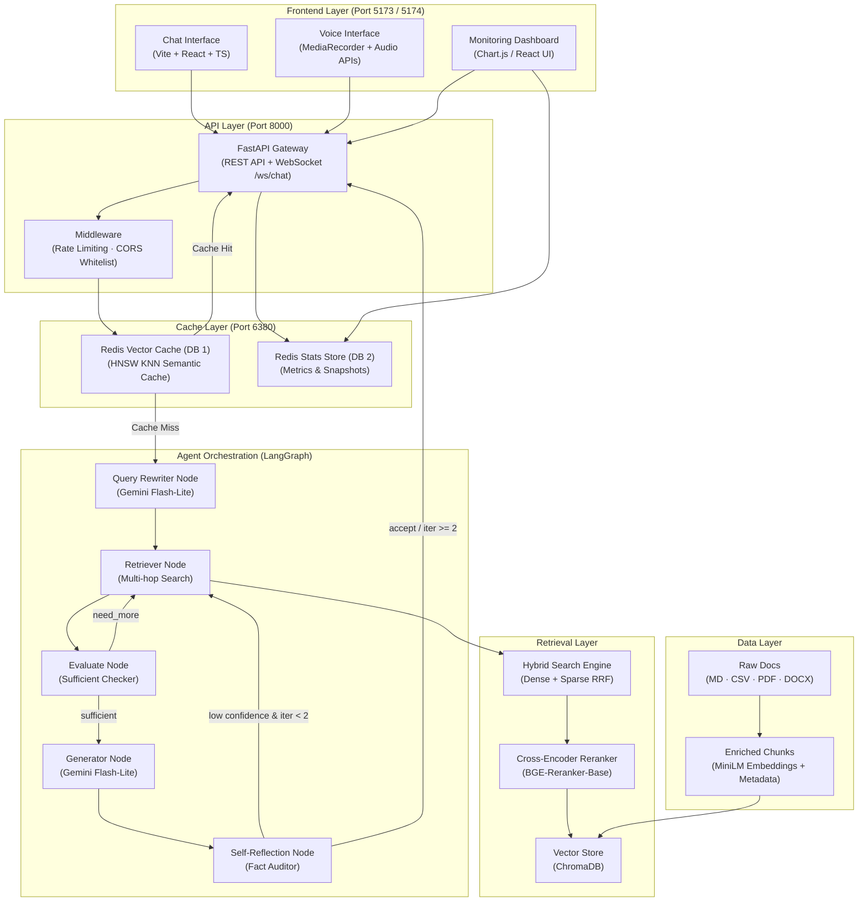
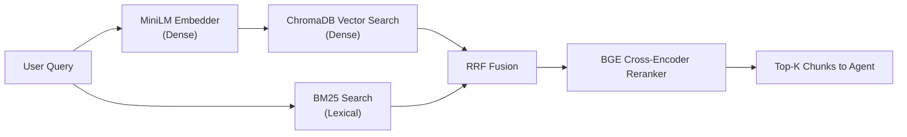
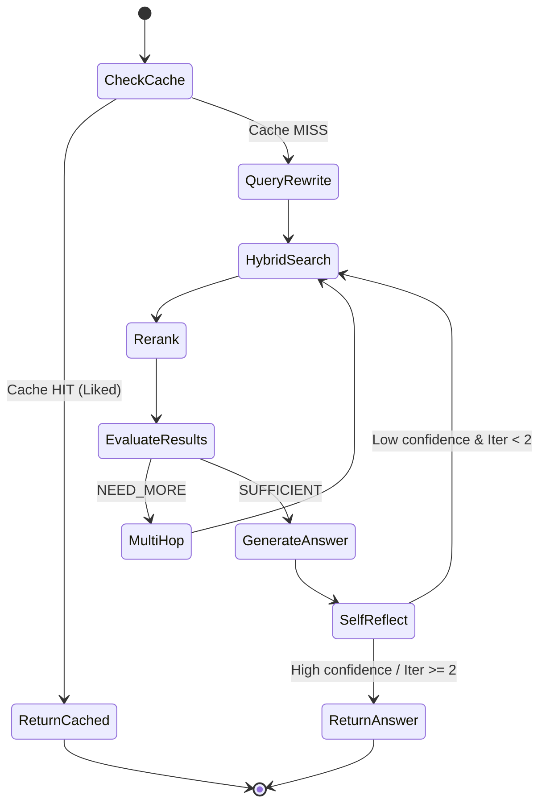
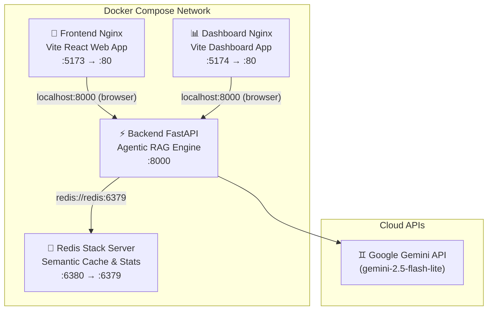

# BKAi — Agentic RAG for Ho Chi Minh City University of Technology (HCMUT) Admissions

> **In-Depth Technical Report - Intelligent AI Admission Consulting System**
> **Developed by:** Long Quan Ton
> **Objective:** Production-ready, Scalable, Hybrid Cloud-Local (Privacy First), supports concurrent users.
> **Version:** 2.0.0

---

## 1. Executive Summary

**BKAi** is an advanced Artificial Intelligence (AI) system dedicated to admission consulting for Ho Chi Minh City University of Technology (HCMUT) - VNU-HCM. To solve the hallucination problem commonly found in traditional LLM/RAG systems, BKAi adopts a **Multi-Agent RAG (Agentic RAG)** architecture combined with a high-performance **Redis Vector Semantic Caching** system.

**4 Core Values Delivered:**
1.  **Absolute Accuracy (100% Grounded):** The system verifies factual data (admission scores, tuition fees, quotas) through LangGraph-driven iterative search loops (multi-hop retrieval) and a dedicated Self-Reflection auditor node. It strictly refuses to fabricate responses.
2.  **Ultra-Low Latency:** Thanks to the Redis Stack HNSW vector semantic cache, response times for common or similar queries are reduced from ~1-3s (LLM generation) to **< 0.1s**.
3.  **Hybrid Cloud-Local Privacy (Data Autonomy):** While LLM reasoning is handled via secure Gemini API endpoints, the entire RAG context, local document processing (PDF, DOCX, CSV, MD), vector stores (ChromaDB), cache, and monitoring stats remain strictly local. No corporate datasets are exposed.
4.  **Comprehensive Observability:** A unified React-based Monitoring Dashboard tracks health metrics, query latency distributions, feedback ratios, and provides step-by-step trace visualization for agent execution.

### Screenshots

<table>
  <tr>
    <td align="center"><b>💬 Chat UI</b></td>
    <td align="center"><b>🤖 RAG Response</b></td>
  </tr>
  <tr>
    <td></td>
    <td></td>
  </tr>
  <tr>
    <td align="center"><b>📊 Monitoring Dashboard</b></td>
    <td align="center"><b>🎙️ Voice Interface</b></td>
  </tr>
  <tr>
    <td></td>
    <td></td>
  </tr>
</table>

---

## 2. System Architecture

The system is built on a modular Microservices architecture, structured to decouple ingestion, retrieval, agent orchestration, caching, and presentation layers.



### 2.1. Project Directory Structure

```text
bkai2/
├── backend/            # Python backend (FastAPI, LangGraph, ChromaDB)
│   ├── agents/         # LangGraph nodes (Query Rewriter, Retriever, Generator, Reflection, State)
│   ├── api/            # API schemas, WebSocket handler, and REST routes
│   ├── config/         # System settings (Pydantic) and prompt templates
│   ├── data/           # Raw and processed knowledge base data
│   │   ├── csv/        # Tabular data (Admission scores, majors, quotas)
│   │   ├── raw/        # Markdown files (Admissions policies, manuals)
│   │   ├── pdf/        # PDF documents (Official announcements)
│   │   ├── docx/       # Microsoft Word files (Admissions guidelines)
│   │   └── processed/  # Serialized indices (BM25 indexes)
│   ├── evaluation/     # RAGAS evaluation suite and golden QA datasets
│   ├── ingestion/      # Data pipeline (Loader, Metadata Tagger, Chunker, Embedder)
│   ├── memory/         # Vector DB persistence and Redis cache connectors
│   ├── services/       # Core services (Guardrails, Audio/Voice service, LLM Factory)
│   ├── tools/          # Retrieval tools (Hybrid Search, Reranker, BM25)
│   ├── utils/          # Vietnamese text helpers, logger, and input sanitizers
│   ├── Dockerfile      # Backend service container definition
│   ├── ingest.py       # CLI ingestion orchestrator
│   └── main.py         # Entry point for the FastAPI server (lifespan manager)
├── frontend/           # Unified client UI: Chat, Voice, and Dashboard (Vite + React + TS)
│   ├── src/            # React codebase (App router, components, pages)
│   ├── Dockerfile      # Multi-stage production build (Vite -> Nginx)
│   ├── nginx.conf      # SPA routing rules for Nginx
│   └── vite.config.ts  # Vite bundler configuration (Tailwind v4 integrated)
├── dashboard/          # Legacy separate telemetry dashboard (Vite + Chart.js)
│   ├── Dockerfile      # Independent dashboard container definition
│   ├── nginx.conf      # Nginx server configurations
│   └── vite.config.js  # Vite dev & build settings
├── docker-compose.yml  # Multi-container orchestration config
├── docs/images/        # Visual documentation assets and screenshots
└── README.md           # This comprehensive guide
```

---

## 3. Technology Stack & Model Routing

BKAi optimizes cost, rate limits, and latency by implementing a **Model Routing** strategy, sending specialized tasks to appropriate model tiers while utilizing thread-safe rate-limiting locks.

### Detailed Tech Stack:
*   **Backend Environment:** Python 3.11+, FastAPI, Uvicorn, WebSockets.
*   **Agentic Orchestration:** LangGraph & LangChain Core.
*   **Vector Engine:** ChromaDB (Local dense store).
*   **Caching & Telemetry:** Redis 7 / Redis Stack (HNSW vector caching & JSON stats).
*   **Voice Processing:** `faster-whisper` (Local Speech-to-Text) & `edge-tts` (Neural Text-to-Speech).
*   **Frontend UI:** React 19, TypeScript, Vite, TailwindCSS v4, Recharts, Chart.js.

### Model Routing & Rate Limiting Strategy:

| Task / Agent | Technology / Model | Design Rationale |
| :--- | :--- | :--- |
| **Query Rewriter** | `gemini-2.5-flash-lite` | Simple rewrites (HyDE + paraphrasing), optimized for speed. Enforces rate limits. |
| **Retrieval Evaluator** | `gemini-2.5-flash-lite` | Evaluates if context is sufficient (Binary/Ternary). Low intelligence requirement. |
| **Answer Generator** | `gemini-2.5-flash-lite` | Highly efficient, fast generation tier, handles markdown structures and streaming outputs. |
| **Self-Reflection** | `gemini-2.5-flash-lite` | Evaluates factual correctness and hallucinations on the fast-lite model. |
| **Embedding Model** | `sentence-transformers/paraphrase-multilingual-MiniLM-L12-v2` | Lightweight multilingual embedding model, optimized for low memory usage and high speed. |
| **Reranking Engine** | `BAAI/bge-reranker-base` | Lightweight Cross-Encoder model scoring query-document pairs, boosting precision with low memory usage. |
| **Guardrails** | Rules + `gemini-2.5-flash-lite` | Regex pattern matching for scope boundaries, with fast LLM backup checking. |
| **Speech-to-Text (STT)** | `faster-whisper` (`base`) | Running locally on CPU. 3-stage custom correction layer for HCMUT terminologies. |
| **Text-to-Speech (TTS)** | `edge-tts` (`vi-VN-HoaiMyNeural`)| Cloud neural voice offering high-fidelity, natural Vietnamese speech. |

> **Rate Limit Enforcement:** To prevent exceeding Google Gemini free-tier quotas, the system implements an async thread lock (`acquire_rpm_slot`) restricting models to `10 RPM` for both Flash and Lite models (configurable in `.env`).

---

## 4. Core Module Analysis

### 4.1. Data Ingestion Pipeline
Transforms raw files (Markdown, CSV, PDF, Word) into search-optimized vector representations:
1.  **Document Loader:** Processes `.md` (header split), `.csv` (row-based structured documents), `.pdf` (`pypdf`), and `.docx` (`python-docx`).
2.  **Metadata Auto-Tagger:** Automatically extracts years (e.g., `2024,2025`), major codes (3-digit codes in `100-499` range), keywords (`khoa học máy tính`, `học phí`, etc.), and detects if the document contains scores.
3.  **Semantic Chunker:** Splits markdown/PDF/Word structures while protecting data tables (never splits mid-row). Capped at `MAX_CHUNK_CHARS = 1500` characters (~375 tokens) with a sliding overlap of `200` characters.

### 4.2. Hybrid Retrieval Engine
Combines semantic similarity and lexical search to prevent coordinate/code mismatches (e.g., misidentifying major code `106` for `107` due to close vector space):



*   **Hybrid Retrieval:** Performs cosine similarity dense search in ChromaDB, queries local `rank-bm25` (lexical search), and fuses their results using Reciprocal Rank Fusion (RRF) in memory.
*   **Cross-Encoder Reranking:** All candidates from the hybrid stage are scored and reranked via `BAAI/bge-reranker-base` to select the final top-k context chunks.

### 4.3. Multi-Agent Orchestration (LangGraph)
Uses an event-driven State Machine featuring loops and conditional transitions:



*   **Multi-Hop Retrieval:** If the evaluator returns `NEED_MORE`, the system triggers an additional retrieval loop using follow-up queries (up to 3 hops).
*   **Selective Reflection:** The factuality check is only active for numeric/factual questions (detected via regex). Casual greetings bypass this to minimize unnecessary latency.

### 4.4. Memory & Semantic Cache Architecture
Combines runtime history with database caches:
*   **Short-term Memory:** A sliding window of the last 6 turns is maintained in the user's conversational state.
*   **Redis Vector Semantic Cache:** Ingests user query embeddings into a Redis HNSW index using `COSINE` distance.
*   **Feedback loop:** New Q&As are cached as `unrated` (7-day TTL). If the user likes (👍) the answer, it is promoted to `liked` (30-day TTL) and becomes available for future semantic cache hits (matching Cosine Similarity >= 0.92).

---

## 5. Security & Reliability Architecture

| Layer / Aspect | Policy & Enforcement Mechanism |
| :--- | :--- |
| **Input Sanitization** | Special character strips, script injection prevention, and a strict limit of 500 characters. |
| **Rate Limiting** | Connection middleware caps requests to 15 per minute per client IP, preventing server overloading. |
| **CORS Whitelist** | Restricts API access exclusively to trusted origins: `localhost:5173`, `localhost:5174`, `localhost:5175`. |
| **Domain Guardrails** | Two stages: Regex check against known topics/off-topic triggers, followed by a `gemini-2.5-flash-lite` filter. |
| **Scraper Sandbox** | The MCP web scraping utility is hardcoded to strictly scan domains within `hcmut.edu.vn` only. |

---

## 6. Performance Metrics & Validation

*   **Multi-format Ingestion:** Successfully handles raw Markdown, structured CSV rows, scanned PDF files, and Word documents in a unified pipeline.
*   **Retrieval Precision:** Decoupled dense/sparse vectors combined with BGE reranking resolved major code differences (e.g., distinguishing Mechatronics from mechanical engineering) with high precision.
*   **Semantic Cache Hit Latency:** **< 0.1s**, bypassing LLM processing entirely.
*   **Agent Pipeline Latency:** Average of **1s-3s** (when utilizing Gemini API endpoints).
*   **Self-Healing Loop:** Successfully catches factual errors, prompting retries to generate correct scores.

---

## 7. Deployment & Installation

### 7.1. Prerequisites

| Tool / Dependency | Minimum Version | Purpose |
| :--- | :--- | :--- |
| **Gemini API Key** | - | Required for generation, rewrite, and reflection tasks |
| **Docker Desktop** | 20.10+ | Containerized runtime |
| **Docker Compose** | v2+ | Multi-service orchestration |
| **Python** | 3.11+ | Local development runtime (for manual runs) |
| **Node.js** | v20+ | Client UI build runtime (for manual runs) |

---

### 7.2. 🐳 Docker Deployment (Recommended)

Docker Compose configures **4 services** (Redis Stack, Backend FastAPI, Frontend Nginx, Dashboard Nginx). The vector stores are saved locally inside Docker volumes.



#### Quick Start (3 commands)

1.  **Configure environment variables:**
    Copy `backend/.env.example` to `backend/.env` and add your Google API key:
    ```bash
    cp backend/.env.example backend/.env
    # Edit backend/.env and configure GOOGLE_API_KEY
    ```

2.  **Build and launch containers:**
    ```bash
    docker compose up --build -d
    ```

3.  **Run document ingestion:**
    ```bash
    docker compose exec backend python ingest.py
    ```

4.  **Access the interfaces:**
    *   **Chat / Voice / Dashboard (React app):** [http://localhost:5173](http://localhost:5173)
    *   **Telemetry Dashboard (Chart.js app):** [http://localhost:5174](http://localhost:5174)
    *   **FastAPI Interactive Docs:** [http://localhost:8000/docs](http://localhost:8000/docs)

#### Docker Service Details

| Service | Container Name | Port Mapping | Healthcheck |
| :--- | :--- | :--- | :--- |
| `redis` | `bkai-redis` | `6380:6379` | `redis-cli ping` |
| `backend` | `bkai-backend` | `8000:8000` | `GET /api/health` |
| `frontend` | `bkai-frontend` | `5173:80` | Nginx HTTP 200 |
| `dashboard` | `bkai-dashboard` | `5174:80` | Nginx HTTP 200 |

#### Docker Commands Reference

```bash
# View container status
docker compose ps

# Follow logs
docker compose logs -f

# Rebuild only the backend after changing Python code
docker compose up --build -d backend

# Stop services and keep volumes
docker compose down

# Stop and delete volumes (wipes database)
docker compose down -v
```

---

### 7.3. Manual Deployment (Development)

To run the application services locally for debugging:

#### 1. Launch Redis (Infrastructure)
Ensure Redis (port 6380) is running. You can run it via Docker:
```bash
docker run -d --name local-redis -p 6380:6379 redis:7-alpine
```

#### 2. Start the Backend API
```bash
cd backend
python -m venv .venv
source .venv/bin/activate  # On Windows: .venv\Scripts\activate
pip install -r requirements.txt

# Run the ingestion script (embeds files into local store)
python ingest.py

# Launch server
python main.py
```

#### 3. Run the Frontend (React app)
```bash
cd frontend
npm install
npm run dev
```

#### 4. Run the Standalone Dashboard
```bash
cd dashboard
npm install
npm run dev
```

---

### 7.4. Updating Data & System Capacity Planning

**How to Update admissions knowledge:**
1.  **Unstructured documents (.md):** Place them in `backend/data/raw/`. Split sections with `## H2 headers` to allow the semantic chunker to process them properly.
2.  **Structured lists (.csv):** Place them in `backend/data/csv/`. Each row is parsed into a structured document.
3.  **PDF announcements (.pdf):** Put them in `backend/data/pdf/`.
4.  **Admissions guidelines (.docx):** Place them in `backend/data/docx/`.
5.  **Run ingestion:** Execute `python ingest.py` (locally or inside the backend container) to rebuild vector spaces and BM25 indexes.

**Capacity & Scaling Limits:**
*   **Vector Scaling:** Utilizing local ChromaDB collections allows quick semantic search across thousands of pages of admissions documents without degradation.
*   **Context Safety:** The retrieval stage strictly limits results to `top_k=20`. Using Gemini's large context window prevents out-of-memory or context-overflow issues as the database scales.
*   **Ingestion Bottleneck:** Generating embeddings (`sentence-transformers/paraphrase-multilingual-MiniLM-L12-v2`) offline runs on CPU/GPU depending on environment variables. Queries, however, remain fast regardless of data size.

---

## 8. Environment Configuration

The primary configurations located in `backend/.env` are:

| Variable | Default Value | Description |
| :--- | :--- | :--- |
| `GOOGLE_API_KEY` | `""` | Google Gemini API Authentication credential. |
| `GEMINI_MODEL_PRIMARY` | `gemini-2.5-flash-lite` | Primary LLM for generating answers and reflection. |
| `GEMINI_MODEL_FAST` | `gemini-2.5-flash-lite` | Lite LLM for query rewrites, evaluations, and guardrails. |
| `GEMINI_RPM_LIMIT_LITE` | `10` | Rate limit (requests per minute) for the Fast model. |
| `GEMINI_RPM_LIMIT_FLASH`| `10` | Rate limit (requests per minute) for the Primary model. |
| `REDIS_URL` | `redis://localhost:6380/0` | Connection URL for semantic caching and stats databases (uses `redis://redis:6379/0` in Docker network). |
| `REDIS_CACHE_DB` | `1` | Redis database ID for semantic caching. |
| `REDIS_STATS_DB` | `2` | Redis database ID for telemetry metrics & stats. |
| `CHROMA_PERSIST_DIR` | `./memory/vector_db` | Path where local ChromaDB vector index is saved. |
| `CHROMA_COLLECTION_NAME` | `bkai_knowledge` | Collection name for ChromaDB knowledge store. |
| `EMBEDDING_MODEL` | `sentence-transformers/paraphrase-multilingual-MiniLM-L12-v2` | Vector embedding model name. |
| `API_HOST` | `0.0.0.0` | Host IP address FastAPI runs on. |
| `API_PORT` | `8000` | Port number FastAPI runs on. |
| `API_CORS_ORIGINS` | `http://localhost:5173,http://localhost:5174,http://localhost:5175` | Whitelisted frontend origins. |
| `HYBRID_SEARCH_ALPHA` | `0.7` | Weight of dense search (1.0 = purely dense, 0.0 = BM25). |
| `RERANK_TOP_K` | `8` | Number of documents remaining after cross-encoder reranking. |
| `RETRIEVAL_TOP_K` | `20` | Initial candidate retrieval count per query. |
| `SEMANTIC_CACHE_THRESHOLD` | `0.92` | Cosine similarity threshold for semantic cache hits. |
| `CACHE_TTL_UNRATED` | `604800` | TTL (in seconds) for unrated cache entries (default: 7 days). |
| `CACHE_TTL_LIKED` | `2592000` | TTL (in seconds) for liked/promoted cache entries (default: 30 days). |
| `MAX_CONCURRENT_USERS` | `8` | Max concurrent active WebSocket connection requests. |
| `RATE_LIMIT_PER_MINUTE` | `15` | Max API requests per minute per IP address. |
| `MAX_INPUT_LENGTH` | `500` | Max character length for user chat questions. |
| `GUARDRAILS_ENABLED` | `true` | Enables/Disables scope control guardrails. |
| `GUARDRAILS_ALLOWED_SCOPE` | `HCMUT_ADMISSIONS` | Allowed domain name constraint check (e.g. HCMUT Admissions). |
| `MCP_SCRAPER_ENABLED` | `true` | (Deprecated/Unused) Real-time web crawler fallback. |
| `APP_NAME` | `BkAI` | Branding app name. |

---

## 9. Troubleshooting

### 1. Backend fails to resolve Gemini models
*   **Error:** `APIKeyError` or timeout.
*   **Solution:** Verify `GOOGLE_API_KEY` is correctly set in `backend/.env`. Check if you've hit your API quota limits.

### 2. Docker: Connection refused to Redis
*   **Error:** Connection errors.
*   **Solution:** In `backend/.env` for local manual development, use `localhost`. For Docker, make sure you configure the URL to match the container service name (e.g., `redis://redis:6379/0`).

### 3. CPU execution bottlenecks during ingestion
*   **Error:** Ingestion takes too long on local machines.
*   **Solution:** The embedding model `sentence-transformers/paraphrase-multilingual-MiniLM-L12-v2` and reranking model `BAAI/bge-reranker-base` are loaded into memory. Ensure your system allocates at least 1.5GB of RAM.

### 4. Semantic cache does not return anything
*   **Reason:** Caching only triggers for responses that have been upvoted/liked (`status = liked`).
*   **Solution:** Go to the Chat Interface and click the Like (👍) button on an answer. It will immediately save it to the cache for future queries.

---

## 10. Future Roadmap & Scaling

1.  **Authentication & Multi-tenancy:** Integrate OAuth2 flows to enable personalized consulting (e.g., saving user mock scores and matching admissions criteria).
2.  **Fully Automated crawler (Cron):** Run background crawler agents to scrape admissions notices and update vector indices automatically.
3.  **Database Querying (Text-to-SQL):** Connect structured candidate databases to query admissions statistical reports securely.
4.  **Scale Redis Stack:** Migrate to hosted Redis Enterprise or elastic instances to support millions of queries.
5.  **RAGAS Evaluation Automated CI/CD:** Set up evaluation scripts to validate retrieval accuracy automatically on data updates.

---
*This technical report is maintained and structured according to project review specifications.*
