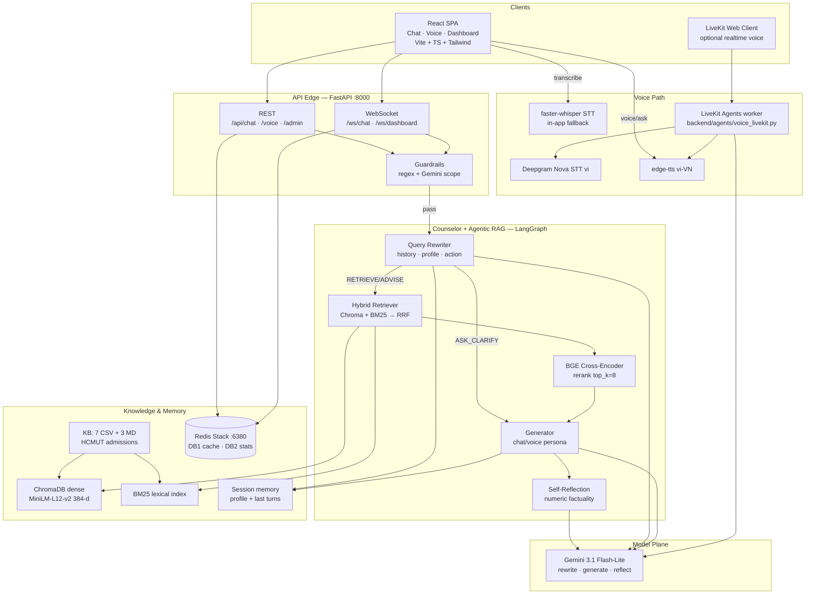
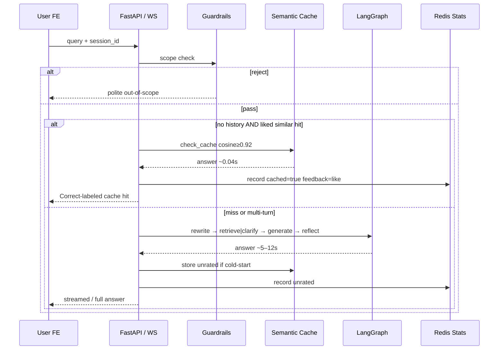
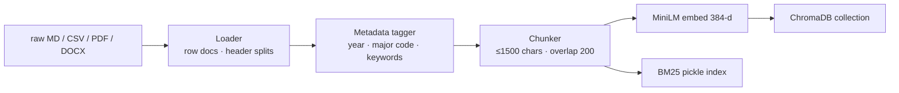
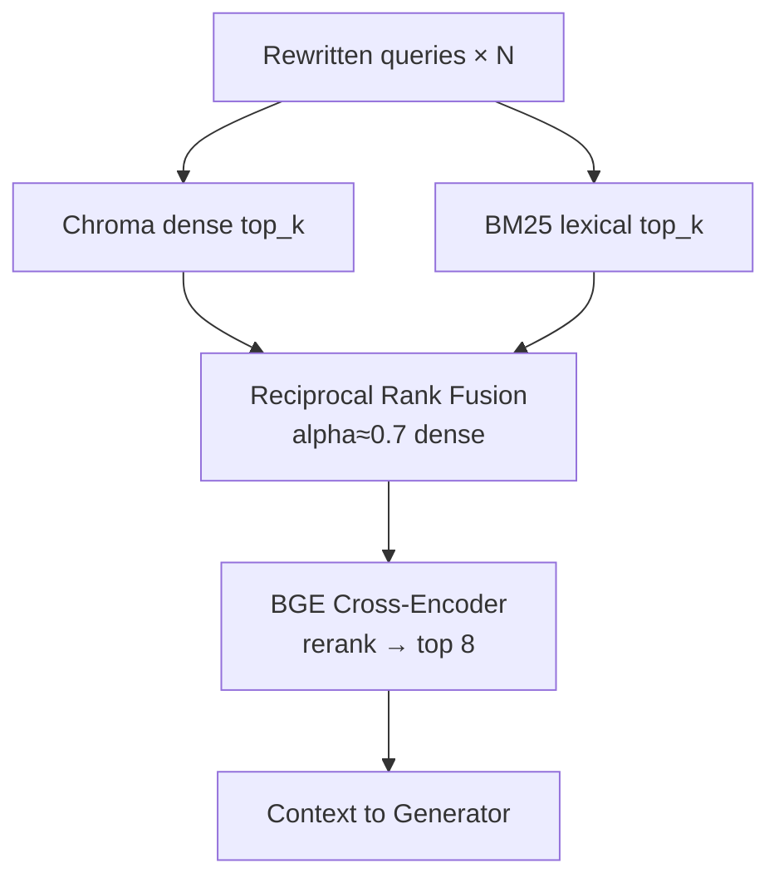
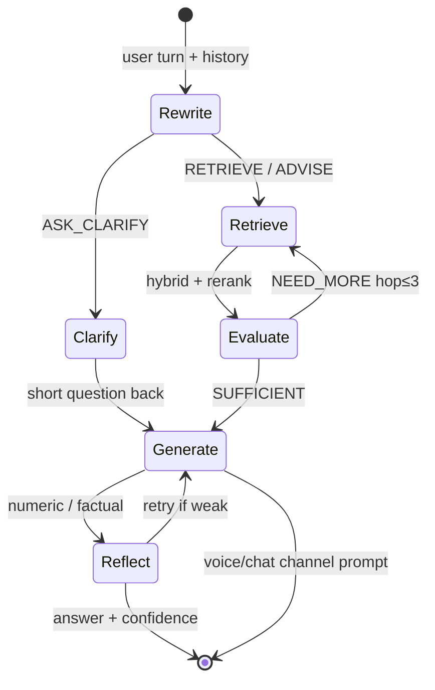
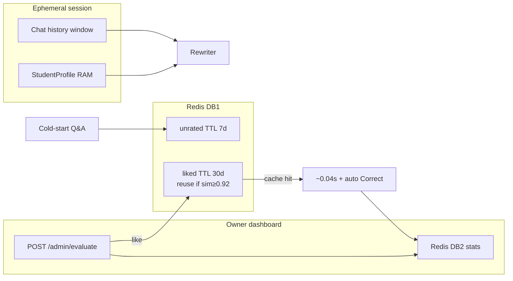
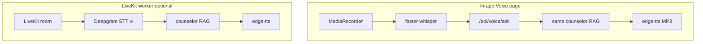
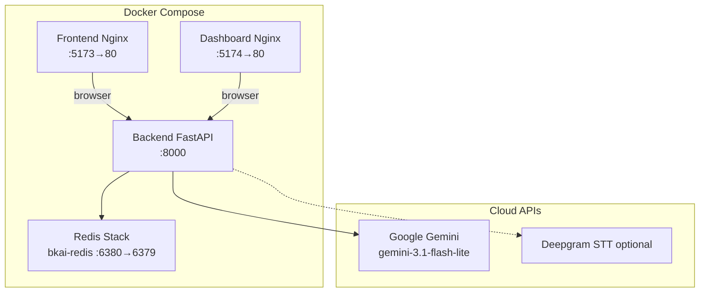

# BKAi — Multi-Agent Admissions Counseling System (HCMUT)

> **In-Depth Technical Report — Multi-Agent Admissions Counseling System**<br/>
> **Developed by:** Long Quan Ton<br/>
> **Objective:** Production-shaped Agentic RAG + conversational counselor (chat & voice), Hybrid Search, Redis semantic caching, owner telemetry.<br/>
> **Version:** 3.0.0

---

## 1. Executive Summary

**BKAi** is an admissions counseling AI for Ho Chi Minh City University of Technology (HCMUT / ĐHQG-HCM). It layers a **counselor policy** (clarify → retrieve → advise) on top of an **Agentic RAG** backbone so answers stay grounded in official CSV/Markdown knowledge—not free-form LLM guesses—while supporting **multi-turn chat**, **voice**, and an **owner evaluation loop**.

**4 Core Key Values** *(impact → metric → how/tech)*:

*   **Raised grounded admissions accuracy to ~85% end-to-end** on a **20-case live API demo** (memory **3/3**, voice **2/2**, guardrail **1/1**; projected **~85/100** on a mixed golden set of similar difficulty), by shipping a multi-hop Agentic RAG + counselor graph with **LangGraph**, **Gemini 3.1 Flash-Lite**, hybrid **ChromaDB + BM25 + BGE reranker**, and Pydantic-validated agent I/O.
*   **Cut repeat-query latency by ~99%** from **~6.1s avg pipeline** to **~0.04–0.05s cache hits** (measured live; cold chat p50 ≈ **5.6s**), by promoting owner-**Correct** answers into a **Redis** semantic cache (cosine ≥ **0.92**, liked TTL **30d**) with MiniLM embeddings and auto-**Correct** labeling on cache hits.
*   **Enabled session-scoped multi-turn counseling + Vietnamese voice** without a user DB—**100%** of memory follow-ups in the demo resolved coreference (e.g. “còn học phí?” after major 106)—via ephemeral **StudentProfile + chat history**, query rewriter (`ASK_CLARIFY | RETRIEVE | ADVISE`), **LiveKit + Deepgram Nova STT (`vi`)**, and **edge-tts** VI neural speech.
*   **Closed the quality loop for ops** with owner dashboard evaluate (**like/dislike** → cache promote), live WebSocket traces, and Redis stats (demo run: questions **11→33**, liked **9→28**), using **FastAPI WebSockets**, **React + Recharts**, and **Redis DB2** telemetry.

### UI Showcase

<table>
  <tr>
    <td align="center"><b>💬 Chat Landing Page</b></td>
    <td align="center"><b>🤖 RAG Answer Response</b></td>
  </tr>
  <tr>
    <td></td>
    <td></td>
  </tr>
  <tr>
    <td align="center"><b>🎙️ Voice Interface Feature</b></td>
    <td align="center"><b>🛡️ Scope Guardrails Rejection</b></td>
  </tr>
  <tr>
    <td></td>
    <td></td>
  </tr>
  <tr>
    <td align="center"><b>📊 User Dashboard (Stats Overview)</b></td>
    <td align="center"><b>📈 Owner Dashboard (Analytics)</b></td>
  </tr>
  <tr>
    <td></td>
    <td></td>
  </tr>
  <tr>
    <td align="center"><b>💻 Live Query Console</b></td>
    <td align="center"><b>💬 Chat Analyst & Feedback History</b></td>
  </tr>
  <tr>
    <td></td>
    <td></td>
  </tr>
  <tr>
    <td align="center" colspan="2"><b>📊 Question Trend & Latency Distribution</b></td>
  </tr>
  <tr>
    <td align="center" colspan="2"></td>
  </tr>
</table>

---

## 2. System Architecture

Modular microservices: ingestion → hybrid retrieval → counselor/Agentic RAG → Redis cache/stats → React chat/voice/dashboard. Optional **LiveKit voice worker** for realtime STT.

### 2.0. System Architecture Diagram



### 2.1. Project Directory Structure

```text
bkai2/
├── backend/            # Python backend (FastAPI, LangGraph, ChromaDB)
│   ├── agents/         # LangGraph nodes + LiveKit voice worker (voice_livekit.py)
│   ├── api/            # REST routes, WebSocket, schemas
│   ├── config/         # Pydantic settings + prompts
│   ├── data/           # Knowledge base
│   │   ├── csv/        # 7 admission score/quota tables
│   │   ├── raw/        # 3 Markdown policy docs
│   │   ├── pdf/ · docx/ · processed/
│   ├── evaluation/     # Golden set, counselor dialogues, demo suite + report
│   ├── ingestion/      # Loader → tagger → chunker → embedder
│   ├── memory/         # Chroma, Redis semantic cache, conversation memory
│   ├── services/       # Guardrails, audio, LLM factory
│   ├── tools/          # Hybrid search, BM25, reranker
│   ├── workflows/      # LangGraph orchestrator
│   ├── ingest.py
│   └── main.py
├── frontend/           # Chat, Voice, Dashboard (Vite + React + TS)
├── dashboard/          # Legacy Chart.js telemetry app
├── docker-compose.yml
├── docs/image/         # UI screenshots
└── README.md
```

---

## 3. Technology Stack & Model Routing

BKAi routes specialized agents to **Gemini 3.1 Flash-Lite** under async RPM locks (~**10–15 RPM** configurable) to stay within API quotas while keeping p50 chat latency in the **~5–7s** band when uncached.

### Detailed Tech Stack
*   **Backend:** Python 3.11+, FastAPI, Uvicorn, WebSockets.
*   **Orchestration:** LangGraph + LangChain Core (counselor actions + multi-hop RAG).
*   **LLMs:** Google Gemini 3.1 Flash-Lite (rewrite / generate / reflect / guardrail assist).
*   **Retrieval:** ChromaDB + `rank-bm25` + RRF + `BAAI/bge-reranker-base`.
*   **Embeddings:** `sentence-transformers/paraphrase-multilingual-MiniLM-L12-v2` (384-d).
*   **Cache & stats:** Redis Stack (`:6380`) — semantic Q&A cache (DB1), dashboard counters (DB2).
*   **Voice:** LiveKit Agents + **Deepgram Nova STT (`vi`)** + **edge-tts** (`vi-VN-HoaiMyNeural`); in-app fallback **faster-whisper** → RAG → TTS.
*   **Frontend:** React 19, TypeScript, Vite, Tailwind CSS v4, Recharts.

### Model Routing

| Task / Agent | Technology / Model | Design Rationale |
| :--- | :--- | :--- |
| **Query Rewriter / Counselor** | `gemini-3.1-flash-lite` | Resolves coreference, patches student profile, emits `ASK_CLARIFY \| RETRIEVE \| ADVISE`. |
| **Retrieval Evaluator** | Heuristic + lite LLM path | `SUFFICIENT` / `NEED_MORE` up to 3 hops. |
| **Answer Generator** | `gemini-3.1-flash-lite` | Chat vs voice persona prompts; grounded on reranked chunks. |
| **Self-Reflection** | `gemini-3.1-flash-lite` | Selective factuality check for numeric admissions answers. |
| **Embedding** | MiniLM-L12-v2 multilingual | Fast CPU embeddings for Chroma + cache similarity. |
| **Reranker** | `BAAI/bge-reranker-base` | Cross-encoder precision on major codes / years. |
| **Guardrails** | Rules + lite Gemini | Keeps scope on HCMUT admissions. |
| **STT** | Deepgram Nova (`vi`) / Whisper | Cloud-first realtime; local fallback for in-app voice. |
| **TTS** | edge-tts VI | Natural Vietnamese audio for `/api/voice/ask` & LiveKit. |

> **Rate limits:** `acquire_rpm_slot` + env `GEMINI_RPM_LIMIT_*` (demo spacing ~**25s**/pipeline under ~15 RPM client cap).

---

## 4. Core Module Analysis

### 4.1. End-to-End Request Flow (high-value path)



### 4.2. Data Ingestion Pipeline

Transforms **7 CSV** score/quota tables + **3 Markdown** policy docs (PDF/DOCX supported) into searchable chunks:



1. **Loader** — `.md` by headers; `.csv` row → structured document; `.pdf` / `.docx` text extract.
2. **Auto-tagger** — years, majors `100–499`, score-bearing flags.
3. **Chunker** — never splits mid-table row; `MAX_CHUNK_CHARS=1500`.

### 4.3. Hybrid Retrieval Engine

Dense + lexical fusion prevents near-miss major codes (e.g. **106** vs **107**, **109** vs **110**):



*   **Hybrid Retrieval:** Chroma cosine + BM25 → RRF in memory.
*   **Cross-Encoder:** `bge-reranker-base` selects final context (`RERANK_TOP_K=8`).

### 4.4. Multi-Agent Orchestration (LangGraph)

Counselor policy sits **above** Agentic RAG—not a replacement:



*   **Multi-hop:** `NEED_MORE` re-queries up to **3** hops.
*   **Selective reflection:** numeric admissions answers only—saves RPM/latency on greetings.
*   **Channel prompts:** shorter spoken answers on `channel=voice`.

### 4.5. Memory, Semantic Cache & Owner Feedback



*   **Short-term memory:** session turns + profile; cleared on **Chat mới** / `/api/session/clear` (page reload keeps `sessionStorage` id → **not** a new chat).
*   **Cache policy:** only **liked/Correct** answers are reusable; cold-start only (`history` empty). Cache hits are recorded as **Correct** by default.
*   **Owner loop:** evaluate → promote/demote cache → live stats / trends.

### 4.6. Voice Counseling Path



Demo voice path: **2/2** cases returned answer text + MP3 (**~108KB–593KB**); first TTS cold ~**45s**, subsequent ~**16s**.

---

## 5. Security & Reliability Architecture

| Layer / Aspect | Policy & Enforcement Mechanism |
| :--- | :--- |
| **Input Sanitization** | Strip injection patterns; hard cap **500** chars. |
| **Rate Limiting** | ~**15 RPM**/IP middleware + Gemini async RPM locks. |
| **CORS Whitelist** | `localhost:5173/5174/5175` (configurable). |
| **Domain Guardrails** | Regex + lite Gemini; demo reject of off-campus scope (**1/1**). |
| **Privacy posture** | No persistent user accounts; session memory in RAM; KB hosted locally (Chroma + files). |

---

## 6. Performance Metrics & Validation

Grounded on a **live offline API demo** (`backend/evaluation/run_demo_suite.py`, **20** cases, ~**25s** spacing, no frontend):

| Metric | Result |
| :--- | :--- |
| **End-to-end pass rate** | **17/20 = 85%** (complete responses **20/20**) |
| **Projected mixed golden @100** | **~85%** point estimate (Wilson 95% ≈ **64–95%**, n=20) |
| **Factual score subset** | **6/9 ≈ 67%** (main fails: year/method mix-ups, rare cache collision) |
| **Memory / multi-turn** | **3/3 = 100%** |
| **Voice (RAG+TTS)** | **2/2 = 100%** |
| **Cold chat latency** | avg ≈ **5.8s**, p50 ≈ **5.6s**, max ≈ **12.4s** |
| **Dashboard avg response time** | **~6.14s** after demo traffic |
| **Semantic cache hit** | **~0.04–0.05s** (~**99%** cut vs cold path) |
| **Owner feedback delta** | questions **+22**, liked **+19** in one demo window |
| **Knowledge base** | **7** CSV + **3** MD admissions sources |

Failure modes observed (honest eval): wrong year/method on TH scores; semantic near-neighbor cache overwrite risk on similar majors—mitigated by liked-only reuse + owner Correct/Incorrect.

---

## 7. Deployment & Installation

### 7.1. Prerequisites

| Tool / Dependency | Minimum Version | Purpose |
| :--- | :--- | :--- |
| **Gemini API Key** | — | Rewrite, generate, reflect, guardrail assist |
| **Docker Desktop** | 20.10+ | Redis Stack / full compose |
| **Docker Compose** | v2+ | Multi-service orchestration |
| **Python** | 3.11+ | Backend local run |
| **Node.js** | v20+ | Frontend local run |
| **Deepgram / LiveKit** *(optional)* | — | Realtime voice worker |

---

### 7.2. Docker Deployment (Recommended)



#### Quick Start

1. **Env:** `cp backend/.env.example backend/.env` → set `GOOGLE_API_KEY` (optional LiveKit/Deepgram keys).
2. **Up:** `docker compose up --build -d`
3. **Ingest:** `docker compose exec backend python ingest.py`
4. **Open:**
    *   App: [http://localhost:5173](http://localhost:5173)
    *   Legacy dashboard: [http://localhost:5174](http://localhost:5174)
    *   API docs: [http://localhost:8000/docs](http://localhost:8000/docs)

| Service | Container | Ports | Health |
| :--- | :--- | :--- | :--- |
| `redis` | `bkai-redis` | `6380:6379` | `redis-cli ping` |
| `backend` | `bkai-backend` | `8000:8000` | `GET /api/health` |
| `frontend` | `bkai-frontend` | `5173:80` | HTTP 200 |
| `dashboard` | `bkai-dashboard` | `5174:80` | HTTP 200 |

```bash
docker compose ps
docker compose logs -f
docker compose up --build -d backend
docker compose down          # keep volumes
docker compose down -v       # wipe volumes
```

---

### 7.3. Manual Deployment (Development)

#### 1. Redis Stack
```bash
docker run -d --name bkai-redis -p 6380:6379 redis/redis-stack-server:latest
# or: docker start bkai-redis
redis-cli -p 6380 ping
```

#### 2. Backend
```bash
cd backend
python -m venv .venv && source .venv/bin/activate
pip install -r requirements.txt
python ingest.py
python main.py
```

#### 3. Frontend
```bash
cd frontend && npm install && npm run dev
```

#### 4. Optional LiveKit voice worker
```bash
cd backend && source .venv/bin/activate
python -m agents.voice_livekit download-files
python -m agents.voice_livekit dev
```

#### 5. Optional legacy dashboard
```bash
cd dashboard && npm install && npm run dev
```

---

### 7.4. Updating Data & Capacity

1. MD → `backend/data/raw/` · CSV → `backend/data/csv/` · PDF/DOCX → respective folders.
2. Re-run `python ingest.py`.
3. **Capacity:** local Chroma scales to thousands of admissions pages; retrieval caps `top_k=20` then rerank **8**; Gemini context absorbs fused chunks safely.

---

## 8. Environment Configuration

| Variable | Default | Description |
| :--- | :--- | :--- |
| `GOOGLE_API_KEY` | `""` | Gemini auth |
| `GEMINI_MODEL_PRIMARY` / `_FAST` | `gemini-3.1-flash-lite` | Generate / rewrite tiers |
| `GEMINI_RPM_LIMIT_LITE` / `_FLASH` | `10` | Per-model RPM locks |
| `REDIS_URL` | `redis://localhost:6380/0` | Cache/stats base URL |
| `REDIS_CACHE_DB` / `REDIS_STATS_DB` | `1` / `2` | Semantic cache · telemetry |
| `CHROMA_PERSIST_DIR` | `./memory/vector_db` | Local vector path |
| `EMBEDDING_MODEL` | MiniLM-L12-v2 multilingual | Query/doc embeddings |
| `HYBRID_SEARCH_ALPHA` | `0.7` | Dense vs BM25 weight |
| `RETRIEVAL_TOP_K` / `RERANK_TOP_K` | `20` / `8` | Retrieve → rerank |
| `SEMANTIC_CACHE_THRESHOLD` | `0.92` | Liked-answer reuse floor |
| `CACHE_TTL_UNRATED` / `_LIKED` | `7d` / `30d` | Cache TTLs |
| `RATE_LIMIT_PER_MINUTE` | `15` | Per-IP API cap |
| `MAX_INPUT_LENGTH` | `500` | Query char limit |
| `GUARDRAILS_ENABLED` | `true` | Scope control |
| `LIVEKIT_*` / `DEEPGRAM_*` | — | Optional realtime voice |

---

## 9. Troubleshooting

### 1. Gemini errors / timeouts
Verify `GOOGLE_API_KEY` and RPM limits; space heavy eval runs (~**25s** between pipelines).

### 2. Redis connection refused
Local: `redis://localhost:6380/0` + Redis Stack container. Docker Compose: `redis://redis:6379/0`.

### 3. Slow ingestion / OOM
MiniLM + BGE reranker need ~**1.5GB+** RAM on CPU machines.

### 4. Semantic cache “not working”
Cache runs only when: **(1)** session has **no history** (use **Chat mới**—reload alone is **not** a new session), **(2)** a **liked/Correct** neighbor exists with cosine ≥ **0.92**. Cache hits auto-label **Correct** on the owner dashboard.

### 5. RediSearch “Cannot create index on db != 0”
Expected with `REDIS_CACHE_DB=1`; system falls back to legacy embedding scan—hits still work for exact/liked queries.

---

## 10. Future Roadmap & Scaling

1. **Auth & multi-tenancy** — persistent counselor profiles beyond session RAM.
2. **Admissions crawler cron** — refresh notices → re-ingest.
3. **Text-to-SQL** on structured enrollment stats.
4. **Hosted Redis / Qdrant** — larger vector + true HNSW on DB0.
5. **RAGAS / golden CI** — expand beyond 20-case demo to 100+ automated checks.
6. **Heavier encoders** — optional `bge-m3` when RAM/GPU allows.

---

*Technical report aligned to BKAi v3.0.0 (counselor + Agentic RAG + voice + owner feedback). Demo metrics from `backend/evaluation/demo_report.json`.*
