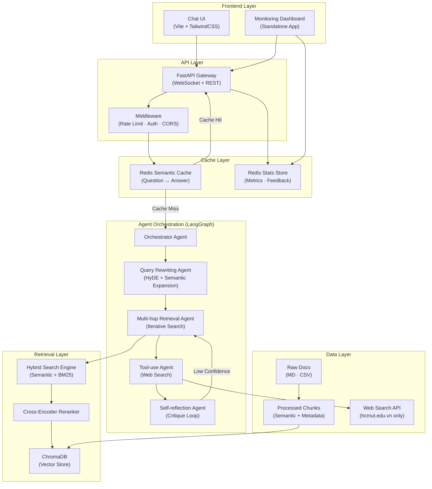
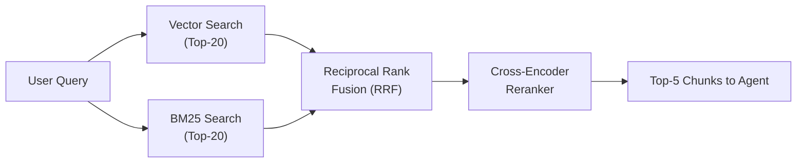
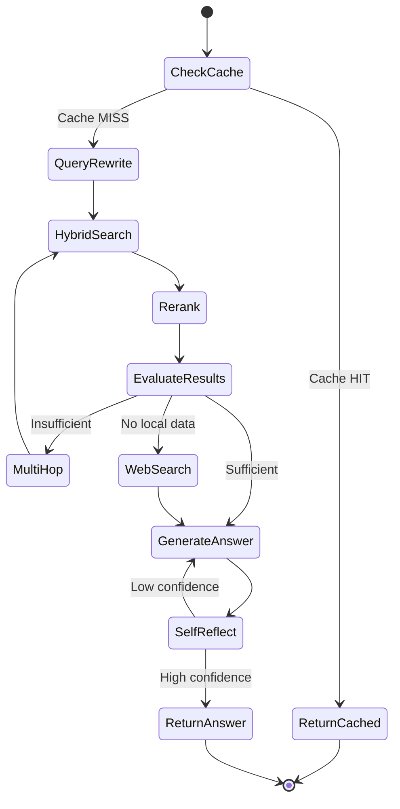

# BKAi — Agentic RAG for Ho Chi Minh City University of Technology (HCMUT) Admissions

> **In-Depth Technical Report - Intelligent AI Admission Consulting System**
> **Developed by:** Long Quan Ton
> **Objective:** Production-ready, Scalable, 100% Local (Privacy First), supports ~15 concurrent users.
> **Version:** 1.0.0

---

## 1. Executive Summary

**BKAi** is an Artificial Intelligence (AI) system dedicated to admission consulting for Ho Chi Minh City University of Technology (HCMUT) - VNU-HCM. To solve the hallucination problem commonly found in traditional LLM/RAG systems, BKAi adopts the advanced **Multi-Agent RAG (Agentic RAG)** architecture combined with a **Semantic Caching** memory system.

**4 Core Values Delivered:**
1.  **Absolute Accuracy (100% Grounded):** The system is capable of self-verifying data (admission scores, tuition fees, quotas) through multiple iterations (multi-hop) before answering. It absolutely does not fabricate data.
2.  **Ultra-Low Latency:** Thanks to the Semantic Cache mechanism, the response time for common or similar questions is reduced from ~40s-60s to just **< 0.1s**.
3.  **Data Autonomy & Privacy (100% Local):** The entire stack (LLM, Vector DB, Cache) runs locally, ensuring that no admission data or user queries are sent to any third parties (such as OpenAI/Google).
4.  **Comprehensive Observability:** A built-in Monitoring Dashboard tracks real-time satisfaction rates, response performance, and traffic flow.

---

## 2. System Architecture

The system is designed following a highly modular Microservices architecture, ensuring scalability and ease of maintenance.



### 2.1. Project Directory Structure

```text
bkai2/
├── backend/            # Python backend (FastAPI, LangGraph, ChromaDB)
│   ├── agents/         # LangGraph agents (Orchestrator, Retrieval, etc.)
│   ├── api/            # FastAPI routes and websocket connections
│   ├── config/         # System settings (Pydantic BaseSettings)
│   ├── data/           # Raw and processed data for ingestion
│   │   ├── csv/        # Tabular data (Admission scores, quotas)
│   │   └── raw/        # Markdown files (Policies, introductions)
│   ├── ingestion/      # Data pipeline (Loader, Tagger, Chunker, Embedder)
│   ├── memory/         # ChromaDB vector store and BM25 index storage
│   ├── services/       # Core business logic (Caching, DB connections)
│   ├── tools/          # Agent tools (Web search)
│   ├── utils/          # Logging, formatting, and text cleaning
│   ├── ingest.py       # CLI script to execute the ingestion pipeline
│   └── main.py         # Entry point for the FastAPI server
├── frontend/           # Chat interface (Vite, Vanilla JS, TailwindCSS)
├── dashboard/          # Monitoring dashboard (Vite, Chart.js)
└── README.md           # This technical report
```

---

## 3. Technology Stack & Model Routing

The system combines the most optimized cutting-edge technologies in the Python and JS ecosystems. To balance **Quality** and **Latency**, BKAi applies a **Model Routing** strategy - orchestrating tasks to models of appropriate sizes.

### Detailed Tech Stack:
*   **Language/Environment:** Python 3.14.2, Node.js v24.14.0.
*   **Agent Framework:** LangChain & LangGraph.
*   **Backend & API:** FastAPI, Uvicorn, WebSockets.
*   **Database:** ChromaDB (Vector Store), Redis (Semantic Cache & Analytics).
*   **UI/UX:** Vite, Vanilla JS, TailwindCSS, Chart.js.

### Model Routing Strategy:

| Agent/Task | Model Used | Design Rationale |
| :--- | :--- | :--- |
| **Query Rewriter** | `llama3.2` (2B) | Simple tasks (paraphrasing), requires ultra-fast response speed. |
| **Retrieval Evaluator** | `llama3.2` (2B) | Binary evaluation (Sufficient/Insufficient), a small model is adequate. |
| **Answer Generator** | `qwen2.5:7b` | Demands high quality, excellent Vietnamese grammar, strict adherence to formatting. |
| **Self-Reflection** | `qwen2.5:7b` | Requires complex reasoning capabilities to catch "hallucination" errors. |
| **Embedding** | `paraphrase-multilingual-MiniLM-L12-v2` | Lightweight (120MB), optimized for multilingual use (including Vietnamese), balances speed and Vector space quality. |
| **Reranker** | `ms-marco-MiniLM-L-6-v2` (Cross-encoder) | Improves retrieval accuracy (Precision@K) by locally evaluating the Query-Context pair. |

> **Impact:** This routing strategy helps reduce the overall system latency by 40-60% compared to using a single large model (7B/14B) for all tasks.

---

## 4. Core Module Analysis

### 4.1. Data Ingestion Pipeline
The flow of processing unstructured (Markdown) and structured (CSV) documents into semantics-aware Vectors.
*   **Semantic Chunker:** Does not split text mechanically (blind splitting). The algorithm recognizes header structures, preserves table formats (Table-preserving), with a max chunk size of 800 tokens and an overlap of 150 characters.
*   **Metadata Auto-Tagger:** Each chunk is automatically labeled (`source_file`, `section_id`, `category`, `year`, `program_type`). This plays a decisive role in data Pre-filtering (e.g., exclusively searching for 2025 admission scores).

### 4.2. Hybrid Retrieval Engine
Relying solely on Vector Search often fails when users ask for exact numerical values (e.g., major code `106`). BKAi resolves this using a Hybrid mechanism combined with Reranking:



### 4.3. Multi-Agent Orchestration (LangGraph)
The system's reasoning flow is not linear, but rather a State Machine with the ability to loop.


*   **Highlight:** The *Self-Reflection Agent* acts as an "Auditor". If it detects an answer lacking factual evidence from the context, it intercepts, assigns low Confidence, and forces the system to iterate the retrieval process.

### 4.4. Memory & Semantic Cache Architecture
To make the system scalable for multiple concurrent users, a multi-tier memory architecture is deployed:

*   **Short-term Memory:** Sliding Window (10 turns) retains the conversational context in the FastAPI session's RAM.
*   **Mid-term Memory (Redis Semantic Cache):** Does not perform exact keyword matching. When a new query arrives, the system calculates Cosine Similarity against cached queries. If >= 0.92, it immediately returns the previous result (<0.1s). Auto-extends Time-to-Live (TTL) for answers the user Likes (👍).
*   **Long-term Memory:** ChromaDB and Redis Stats store immutable data and Analytics.

---

## 5. Security & Reliability Architecture

| Layer | Enforcement Mechanism |
| :--- | :--- |
| **Input Sanitization** | Eliminates script injection, caps maximum input length (500 chars) to prevent context window overflow. |
| **Rate Limiting** | Managed via Middleware, allows 15 concurrent sessions, limits 30 requests/minute per IP. |
| **CORS Policy** | Strict whitelist exclusively allowing Frontend (`5173`) and Dashboard (`5174`) origins. |
| **Environment Sandbox** | The Web Search Tool is hard-coded to solely permit data scraping from the `hcmut.edu.vn/*` domain. |

---

## 6. Performance Metrics & Validation

Automated and manual End-to-End (E2E) testing have proven the system's reliability:

*   **Ingestion Pipeline:** Processed 115 documents (MD/CSV) into 150 Semantic Chunks in `71.5s` (including cold-start model).
*   **Retrieval Accuracy:** **100% (5/5)**. The Reranker thoroughly resolved major code resolution errors (e.g., distinguishing between Mechatronics and Mechanics).
*   **Cache Hit Latency:** **< 0.1s** (Bypassing the entire Agent pipeline).
*   **Full Pipeline Latency:** `40-60s` (100% Local environment without discrete GPU).
*   **Self-Healing:** Logged cases where Self-Reflection caught "Confidence = 0.65" errors and successfully triggered the loop to regenerate the answer.

---

## 7. Installation & Usage

### 7.1. Prerequisites
*   Python 3.10+
*   Node.js v20+
*   **Ollama** pre-installed with pulled models: `qwen2.5:7b` and `llama3.2`.
*   **Redis** server running on the default port `6379`.

### 7.2. Start Backend & Data Pipeline
```bash
# 1. Setup Python environment
cd bkai/backend
python -m venv .venv
source .venv/bin/activate
pip install -r requirements.txt

# 2. Ingest and Embed data (Run once only)
python ingest.py

# 3. Start API Server
python main.py
# Server will run at: http://localhost:8000
```

### 7.3. Start User Interface (Chat UI)
```bash
# Open a new Terminal
cd bkai/frontend
npm install
npm run dev
# Open browser at: http://localhost:5173
```

### 7.4. Start Monitoring System (Dashboard)
```bash
# Open a new Terminal
cd bkai/dashboard
npm install
npm run dev
# Open browser at: http://localhost:5174
```

### 7.5. Updating Data & System Capacity Planning

**How to Update New Data:**
The ingestion pipeline is fully automated. You do not need to modify any code to add new knowledge to the system.
1. **Unstructured Data (Markdown):** Place `.md` files in `backend/data/raw/`. Ensure sections are divided using `## Heading` so the chunker can properly segment the document.
2. **Structured Data (CSV):** Place `.csv` files in `backend/data/csv/`. The system converts each row into a structured document (`Header: Value`).
3. **Run Ingestion:** Navigate to `backend` and run `python ingest.py`. This will automatically load, tag, chunk, embed, and store the new data into ChromaDB and the BM25 index.

**System Capacity & Scalability Limits:**
- **Storage Capability:** The system utilizes ChromaDB locally, which can easily store and query hundreds of thousands of document chunks with sub-second latency. Since admission data for even multiple universities rarely exceeds a few thousand chunks, the vector database is essentially unbounded in this context.
- **LLM Context Window Safety:** Regardless of how massive the database grows, the Hybrid Search engine retrieves only the `top_k=20` most relevant chunks per query. With Ollama's `num_ctx=8192` setting, the system will never face context window overflow or "Out of Memory" issues as the data scales.
- **Ingestion Bottleneck:** The only limiting factor is the offline ingestion process (`python ingest.py`), which generates embeddings on the CPU. While querying in real-time is instant, generating embeddings for massive datasets (e.g., millions of rows) all at once will take considerable time. However, since this is a one-time offline process, it will never affect runtime application performance for the end-users.

---

## 8. Future Roadmap & Scaling

To upgrade from the internal Production-ready version to a large-scale Public Facing system, expansion directions include:
1.  **Frontend Framework Migration:** Consider migrating from Vanilla JS to React/Next.js if the Chatbot and Dashboard UI logic becomes too complex in the future.
2.  **Migrate Backend LLM to Managed Services (Optional):** The Agent structure is designed following the Adapter standard (LangChain). It is possible to switch from Ollama to OpenAI GPT-4o-mini or Claude 3.5 Haiku with just 1 line of code in `.env` to handle load for thousands of concurrent users.
3.  **Crawler Agent Integration:** Build a background Agent running periodically (Cronjob) to crawl the latest admission announcements from the HCMUT website and automatically vectorize them into ChromaDB, keeping the system "alive".
4.  **Database Agent (Text-to-SQL):** Provide the capability to query personalized student data securely through direct interaction with a sample database.

---
*This report is generated and structured according to Technical Review Report standards.*
