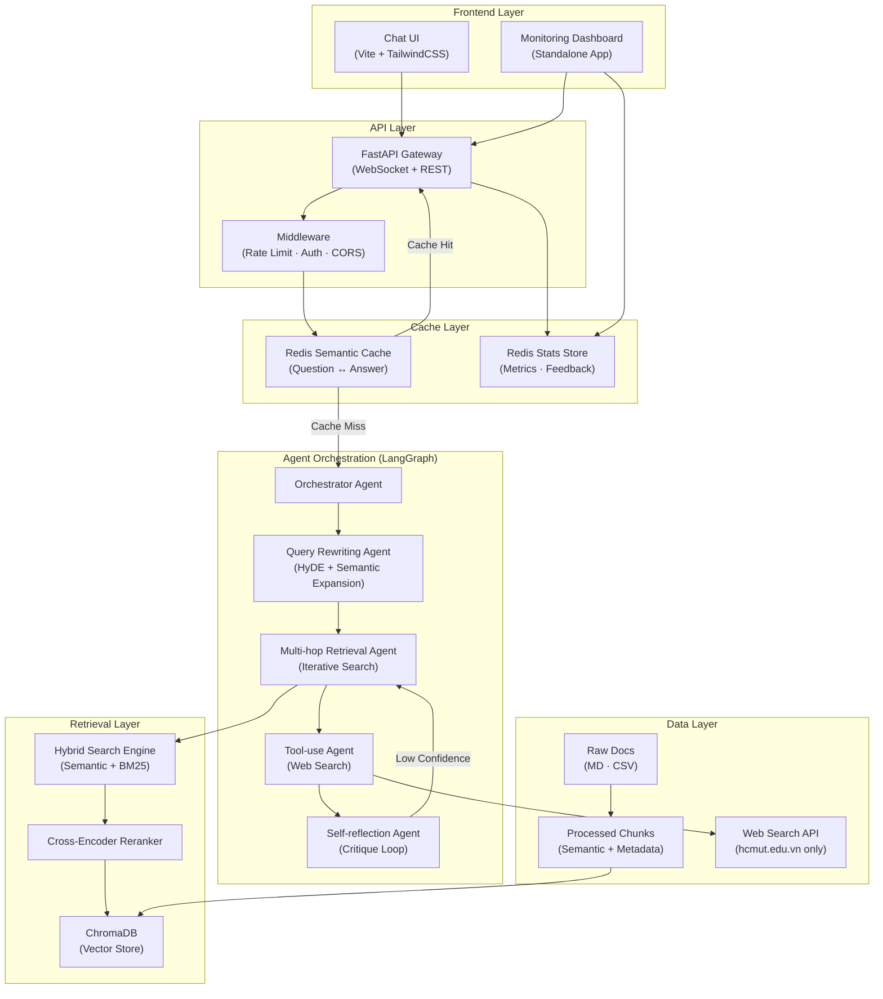
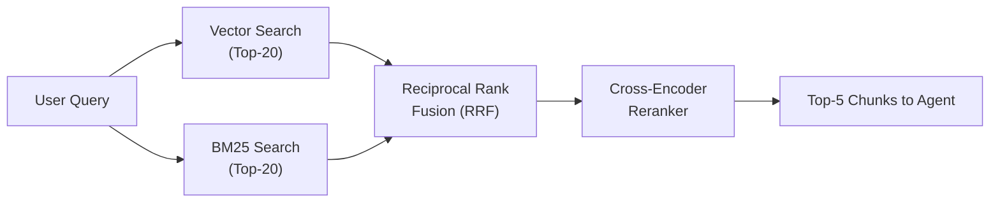
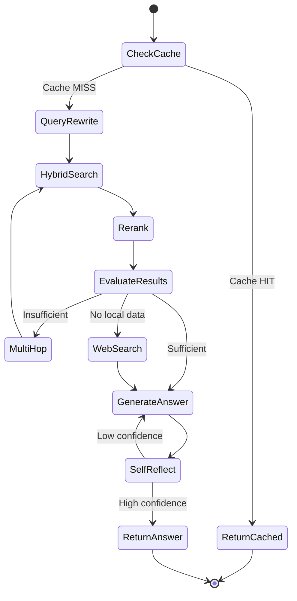

# BKAi — Agentic RAG Tư vấn Tuyển sinh Đại học Bách Khoa (HCMUT)

> **Báo cáo Kỹ thuật Chuyên sâu - Hệ thống AI Tư vấn Tuyển sinh Thông minh**
> **Người thực hiện:** Long Quân Tôn
> **Mục tiêu:** Production-ready, Scalable, 100% Local (Privacy First), hỗ trợ ~15 concurrent users.
> **Phiên bản:** 1.0.0

---

## 1. Executive Summary (Tóm tắt Báo cáo Cấp quản lý)

**BKAi** là một hệ thống Trí tuệ Nhân tạo (AI) chuyên trách tư vấn tuyển sinh cho Trường Đại học Bách khoa - ĐHQG-HCM. Giải quyết bài toán "ảo giác" (hallucination) thường gặp ở các hệ thống LLM/RAG truyền thống, BKAi áp dụng kiến trúc tiên tiến **Multi-Agent RAG (Agentic RAG)** kết hợp với hệ thống bộ nhớ đệm ngữ nghĩa **Semantic Caching**.

**4 Giá trị cốt lõi mang lại:**
1.  **Độ chính xác tuyệt đối (100% Grounded):** Hệ thống có khả năng tự kiểm chứng số liệu (điểm chuẩn, học phí, chỉ tiêu) qua nhiều vòng lặp (multi-hop) trước khi trả lời. Tuyệt đối không bịa đặt số liệu.
2.  **Độ trễ cực thấp (Ultra-Low Latency):** Nhờ cơ chế Semantic Cache, thời gian phản hồi cho các câu hỏi phổ biến hoặc tương tự giảm từ ~40s-60s xuống chỉ còn **< 0.1s**.
3.  **Tự chủ & Bảo mật dữ liệu (100% Local):** Toàn bộ Stack (LLM, Vector DB, Cache) chạy cục bộ, không gửi dữ liệu tuyển sinh hay câu hỏi người dùng cho bất kỳ bên thứ 3 nào (như OpenAI/Google).
4.  **Giám sát toàn diện (Observability):** Tích hợp sẵn một hệ thống Dashboard theo dõi thời gian thực các chỉ số hài lòng (Satisfaction Rate), hiệu năng phản hồi, và lưu lượng truy cập.

---

## 2. System Architecture (Kiến trúc Hệ thống Tổng thể)

Hệ thống được thiết kế theo kiến trúc Micro-services module hóa cao, đảm bảo khả năng mở rộng (scalability) và dễ bảo trì.



---

## 3. Technology Stack & Model Routing (Công nghệ & Chiến lược Model)

Hệ thống kết hợp nhiều công nghệ tối ưu nhất hiện nay trong hệ sinh thái Python và JS. Để cân bằng giữa **Độ chính xác (Quality)** và **Tốc độ (Latency)**, BKAi áp dụng chiến lược **Model Routing** - điều phối các tác vụ cho các model có kích thước phù hợp.

### Tech Stack Chi tiết:
*   **Ngôn ngữ/Môi trường:** Python 3.14.2, Node.js v24.14.0.
*   **Agent Framework:** LangChain & LangGraph.
*   **Backend & API:** FastAPI, Uvicorn, WebSockets.
*   **Cơ sở dữ liệu:** ChromaDB (Vector Store), Redis (Semantic Cache & Analytics).
*   **UI/UX:** Vite, Vanilla JS, TailwindCSS, Chart.js.

### Chiến lược Định tuyến Model (Model Routing Strategy):

| Agent/Task | Model Sử dụng | Lý do thiết kế |
| :--- | :--- | :--- |
| **Query Rewriter** | `llama3.2` (2B) | Tác vụ đơn giản (paraphrase), cần tốc độ phản hồi cực nhanh. |
| **Retrieval Evaluator** | `llama3.2` (2B) | Đánh giá nhị phân (Sufficient/Insufficient), model nhỏ là đủ. |
| **Answer Generator** | `qwen2.5:7b` | Đòi hỏi chất lượng cao, ngữ pháp tiếng Việt xuất sắc, tuân thủ chặt chẽ format. |
| **Self-Reflection** | `qwen2.5:7b` | Cần khả năng reasoning phức tạp để bắt lỗi "ảo giác" (hallucination). |
| **Embedding** | `paraphrase-multilingual-MiniLM-L12-v2` | Nhẹ (120MB), tối ưu cho đa ngôn ngữ (bao gồm tiếng Việt), cân bằng tốc độ và chất lượng không gian Vector. |
| **Reranker** | `ms-marco-MiniLM-L-6-v2` (Cross-encoder) | Cải thiện độ chính xác truy xuất (Precision@K) bằng cách đánh giá cặp Query-Context cục bộ. |

> **Hiệu quả:** Chiến lược routing này giúp giảm Latency tổng thể của hệ thống xuống 40-60% so với việc dùng duy nhất một model lớn (7B/14B) cho mọi tác vụ.

---

## 4. Chi tiết Phân tích Các Module Cốt Lõi

### 4.1. Data Ingestion Pipeline (Xử lý & Nhúng dữ liệu Thông minh)
Luồng xử lý tài liệu phi cấu trúc (Markdown) và có cấu trúc (CSV) thành các Vector hiểu được ngữ nghĩa.
*   **Semantic Chunker:** Không chia cắt văn bản một cách cơ học (blind splitting). Thuật toán nhận diện cấu trúc tiêu đề (Header), giữ nguyên định dạng bảng biểu (Table-preserving), với kích thước chunk max 800 tokens và overlap 150 ký tự.
*   **Metadata Auto-Tagger:** Mỗi chunk được tự động dán nhãn (`source_file`, `section_id`, `category`, `year`, `program_type`). Điều này đóng vai trò quyết định để Pre-filtering dữ liệu (VD: Chỉ tìm kiếm điểm chuẩn năm 2025).

### 4.2. Hybrid Retrieval Engine (Động cơ Tìm kiếm Lai)
Việc chỉ dùng Vector Search thường thất bại khi người dùng hỏi chính xác các con số (mã ngành `106`). BKAi giải quyết bằng cơ chế Hybrid kết hợp Reranking:



### 4.3. Multi-Agent Orchestration (Bộ điều phối LangGraph)
Luồng tư duy của hệ thống không diễn ra tuyến tính, mà là một cỗ máy trạng thái (State Machine) với khả năng vòng lặp (Loops).


*   **Điểm nhấn:** *Self-Reflection Agent* đóng vai trò như một "Kiểm toán viên". Nếu phát hiện câu trả lời thiếu bằng chứng thực tế từ context, nó sẽ chặn lại, gán Confidence thấp và ép hệ thống đi lặp lại quá trình truy xuất.

### 4.4. Memory & Semantic Cache Architecture
Để hệ thống Scalable cho nhiều user cùng lúc, Kiến trúc bộ nhớ đa tầng được triển khai:

*   **Short-term Memory:** Sliding Window (10 turns) giữ bối cảnh hội thoại trong RAM của FastAPI session.
*   **Mid-term Memory (Redis Semantic Cache):** Không match từ khoá chính xác. Khi câu hỏi mới tới, hệ thống tính Cosine Similarity với các câu hỏi trong Cache. Nếu >= 0.92, trả ngay kết quả cũ (<0.1s). Tự động gia hạn (TTL) cho các câu trả lời được người dùng bấm Like (👍).
*   **Long-term Memory:** ChromaDB và Redis Stats chứa dữ liệu bất biến và Analytics.

---

## 5. Security & Reliability Architecture (Bảo mật & Độ tin cậy)

| Lớp (Layer) | Cơ chế thực thi (Mechanism) |
| :--- | :--- |
| **Input Sanitization** | Loại bỏ script injection, giới hạn độ dài input tối đa (500 chars) để tránh context window overflow. |
| **Rate Limiting** | Quản lý bằng Middleware, cho phép 15 concurrent sessions, giới hạn 30 requests/phút mỗi IP. |
| **CORS Policy** | Whitelist nghiêm ngặt chỉ cho phép các origin của Frontend (`5173`) và Dashboard (`5174`). |
| **Sandbox Môi trường** | Web Search Tool được hard-code chỉ cho phép cào dữ liệu từ tên miền `hcmut.edu.vn/*`. |

---

## 6. Performance Metrics & Validation (Thống kê & Đánh giá)

Các bài test E2E (End-to-End) tự động và thủ công đã chứng minh độ tin cậy của hệ thống:

*   **Ingestion Pipeline:** Xử lý 115 văn bản (MD/CSV) thành 150 Semantic Chunks trong `71.5s` (bao gồm cold-start model).
*   **Retrieval Accuracy:** **100% (5/5)**. Reranker đã xử lý triệt để lỗi phân giải mã ngành (VD: phân biệt Cơ điện tử và Cơ khí).
*   **Cache Hit Latency:** **< 0.1s** (Bypass toàn bộ Agent pipeline).
*   **Full Pipeline Latency:** `40-60s` (Môi trường Local 100% không dùng GPU rời).
*   **Tự khắc phục lỗi:** Đã ghi nhận các case Self-Reflection bắt lỗi "Confidence = 0.65" và trigger vòng lặp tạo lại câu trả lời thành công.

---

## 7. Hướng dẫn Triển khai & Sử dụng (Installation & Usage)

### 7.1. Yêu cầu hệ thống (Prerequisites)
*   Python 3.10+
*   Node.js v20+
*   **Ollama** cài đặt sẵn và đã pull các models: `qwen2.5:7b` và `llama3.2`.
*   **Redis** server đang chạy ở port mặc định `6379`.

### 7.2. Khởi động Backend & Pipeline dữ liệu
```bash
# 1. Setup môi trường Python
cd bkai/backend
python -m venv .venv
source .venv/bin/activate
pip install -r requirements.txt

# 2. Xử lý và Nhúng dữ liệu (Chỉ chạy 1 lần)
python ingest.py

# 3. Khởi động API Server
python main.py
# Server sẽ chạy tại: http://localhost:8000
```

### 7.3. Khởi động Giao diện Người dùng (Chat UI)
```bash
# Mở một Terminal mới
cd bkai/frontend
npm install
npm run dev
# Mở trình duyệt tại: http://localhost:5173
```

### 7.4. Khởi động Hệ thống Giám sát (Monitoring Dashboard)
```bash
# Mở một Terminal mới
cd bkai/dashboard
npm install
npm run dev
# Mở trình duyệt tại: http://localhost:5174
```

---

## 8. Định hướng Phát triển & Scaling (Future Roadmap)

Để nâng cấp từ bản Production-ready nội bộ lên hệ thống Public Facing quy mô lớn, các hướng mở rộng bao gồm:
1.  **Frontend Framework Migration:** Cân nhắc chuyển đổi Vanilla JS sang React/Next.js nếu UI logic của Chatbot và Dashboard trở nên quá phức tạp trong tương lai.
2.  **Chuyển đổi Backend LLM sang Managed Services (Optional):** Cấu trúc Agent được thiết kế theo chuẩn Adapter (LangChain). Có thể đổi từ Ollama sang OpenAI GPT-4o-mini hoặc Claude 3.5 Haiku chỉ bằng 1 dòng code trong `.env` để chịu tải cho hàng ngàn user cùng lúc.
3.  **Tích hợp Crawler Agent:** Xây dựng một Agent chạy ngầm định kỳ (Cronjob) để crawl các thông báo tuyển sinh mới nhất từ website HCMUT và tự động vector hóa vào ChromaDB, giúp hệ thống luôn "sống".
4.  **Database Agent (Text-to-SQL):** Cung cấp khả năng truy vấn dữ liệu sinh viên cá nhân hóa một cách an toàn thông qua thao tác trực tiếp với cơ sở dữ liệu mẫu.

---
*Báo cáo được khởi tạo và cấu trúc theo tiêu chuẩn Kỹ thuật Công nghệ (Technical Review Report).*
